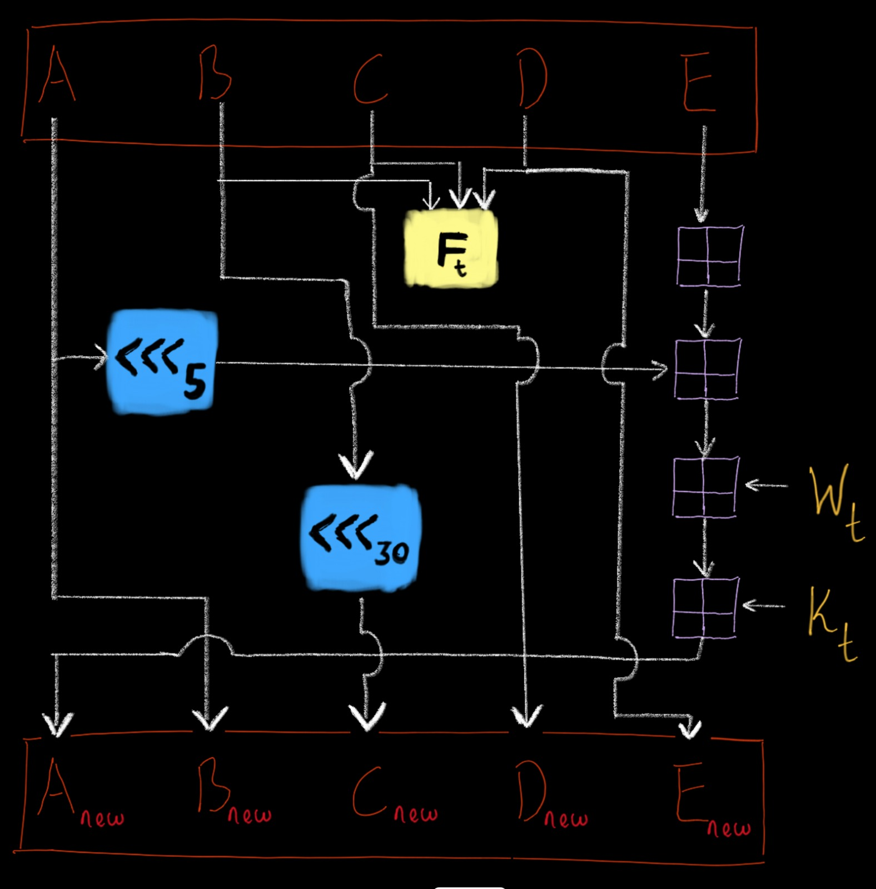

# SHA-1 Cryptographic hashing and hash-cracking

1. Takes user input of a passcode, passphrase or short message and converts it to a digest of 40 hexadecimal digits.
2. Returns the message/passcode/passphrase from any given digest from two different methods
    * Burte Force (as seen in BruteForce.py file)
    * Random (as seen in Random.py file)

## SHA_1.py file
This file contains the algorithm for SHA_1. The input message from the user is firstly converted into bits as seen in the function ```string2bin(...)```.

The following also occurs:
1. Padding of the message into a 512-bit block
2. Forming a message schedule by further expanding the given message into 80 sub-blocks
3. Functions for logical bitwise operation, bit-rotation and bit addition.
Bit addition may lead to overflow and extra highest-signifact-bits are ignored.
4. ```ROUND(...)``` handles each round (out of 80 total rounds) of encrypting the message further. Each round can be depicted in the image below. There are 4 different  stages ('t') with 20 rounds per stage. Each stage has its own Function (F_t) and constant (K_t) that are fed into the rounds and change within the next upcoming stage. See image below for each occuring round:



5. ```get_digest(...)``` uses all the above functions in unison to give the 40 hexadecimal digits (a.k.a the digest) of the given message.
6. A function that prints a specific format of time taken to run either brute force or random method: `show_time_taken(seconds)`

The file can be run by running ```python ./SHA_1.py``` on any terminal emulator on a computer with Python 3 installed.

## BruteForce.py file
This file uses brute force to find the passphrase from a given 40 hexadecimal digits. It checks every instance of a word and sees if its digest is the same as the given digest. 

The main function `BF(...)` takes in:
1. `digest` -> 40 hexadecimal digest from user
2. `p_len` -> Suspected length of the original passphrase
3. `rep` -> Suspected maximum repetition of letters within the original message.
4. `char_s` -> List of all possible characters suspected to have been in the original message.
5. `start_time` ->  Current time in seconds since the Epoch (to be used in printing time taken for code to run; `show_time_taken(seconds)`)

The function ``brute_force(...)`` uses recursion to produce each instance of a word. The largest number of passphrases to be tested is generally:
    (length of char_s)^p_len

e.g. if `p_len = 4` and `char_s = [a,B,c]` (and assuming `rep = p_len`) the words to be tested would be as follows: 

    aaaa, aaaB, aaac, aaBa, aaBB, ..., ccca, cccB, cccc

Max words tested =   (3)^4 = 81

However if `p_len = 10` and `char_s = list of all lowercase alphabets`

Max words tested = (10)^26, which takes a larger amount of time. Asking the user for more specific searches such as guessing length of original message may be used to reduce the umber of words/sentences being tested. A better but riskier alternative would is given to the user (see Random.py)

The file can be run by running ```python ./BruteForce.py``` on any terminal emulator on a computer with Python 3 installed.

## Random.py file
This file creates Random words to find the passphrase from a given 40 hexadecimal digits. It creates a word, gets its digest, and compares it to the given digest from the user. 

The main function `R(...)` takes in:
1. `digest` -> 40 hexadecimal digests from user
2. `p_len` -> Suspected length of the original passphrase
3. `rep` -> Suspected maximum repetition of letters within the original message.
4. `char_s` -> List of all possible characters suspected to have been in the original message.
5. `start_time` ->  Current time in seconds since the Epoch (to be used in printing time taken for code to run; `show_time_taken(seconds)`)

e.g. if `p_len = 4` and `char_s = [a,B,c]` (and assuming `rep = p_len`), then is allows a wider range of words within the spectrum `aaaa` and `cccc` to be tested immediately. Time taken in this method has a higher probability of finding the word in a shorter time but there is also the risk of taking more time compared to the definite time frame of the brute force method.

Random method has the disadvantage of testing a word it has made before. Thus a specialized caching mechanism (that uses lru_cache) is used to store words that have already been used and hence don't need to be passed into `get_digest()` to get its 40 hexadecimal counterpart. There is a restriction on each 'message and 40_hexadecimal_digits' pair after which will be deleted within 1 hour of caching them.

The file can be run by running ```python ./Random.py``` on any terminal emulator on a computer with Python 3 installed.

## main.py file
This file guides the user with a few questions and  utilizes the preceding files discussed above in order to produce either  digest from  a given message or vice versa.

The file can be run by running ```python ./main.py``` on any terminal emulator on a computer with Python 3 installed.
